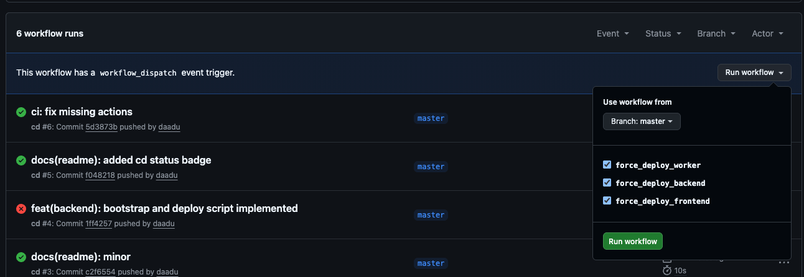

# Hanomi Deployment PoC

[](https://github.com/daadu/hanomi-deploy-poc/actions/workflows/cd.yml)

This is the main repo, for deploying Hanomi services.

## Services

- `frontend`: Next.js application running on Linux VM
- `backend`: Go backend service running on Linux VM
- `worker`: Python worker service running on Windows VM

Currently the contract dependencies is `frontend -> backend -> worker`:
- An API called by `frontend` should always be handled by `backend`
- A job dispatched by `backend` should always be executed by `worker`
- The contract ownership and responsitlity is with the "right side" of the dependency chain. For eg. for `A -> B`, `B` is the contract owner, and `A` is the contract consumer.
- Therefore the deployment order (in case want to deploy multiple services together) should be `worker -> backend -> frontend`, and they should be deployed in same order, 1 at a time.
- **IMPORTANT:** We should never do breaking changes (e.g. removing a field in API response in backend, or changing the signature of a function in worker) in the contracts. If want to drop the support for an old contract, we should deprecate it first and then remove it after a grace period.
- This way we ensure, we always have a working system, and we only do "rollback" for the service that failed to deploy. For eg: when we trigger a deploy all 3 services together with new feature, and say `worker` got deployed, but `backend` failed to deploy, we only rollback `backend` to the previous version. The new deployed `worker` have new functionality but won't be invoke, and it will continue to work with older `backend`.

> Note: The alternate to handle failed deployment, when doing multiple services together would be to do full rollback, but that would be more time-consuming and given we have live traffic, it would be more risky. Instead incorporating the hard guideline of "never do breaking changes in contracts" and "deprecate first, remove later" would make the deployment process much simpler and safer.

> Note: When introducing new service, the contract dependency chain/graph should be re-evalauted and the deployment order should be adjusted accordingly. The naming convention for the service directory, will force to think about the dependency chain while introducing new service.

## Repository structure

Each service have thier own directory, with their own "utility" scripts for building and deployment, manged by the platform team. These directory would also include the source as a git submodule at `./code`. The directory name should have the service order (as per dependency chain) prefixed with a number, such that larger number depends on smaller number.

```
1-worker/
├── code/ (git submodule)
├── build.sh
├── deploy.ps1
└── ...

2-backend/
├── code/ (git submodule)
├── build.sh
├── deploy.sh
└── ...

3-frontend/
├── code/ (git submodule)
├── build.sh
├── deploy.sh
└── ...
```

The required scripts are as follows:

- `build.sh`: Build artifact from code, will be executed in CI-runner (always linux). Output any artifact to `./build` directory.
- `deploy.{sh,ps1,py}`: Deploy artifact to server, will be executed in server (linux or window VM)

## VM setup

Each VM will run only 1 service. VM could be either linux or windows, depending on the service requirements.

### Service directory structure

The `SERVICE_DIR` would be where all the required resources for the services are stored. It will be `$HOME/hanomi/<module-name>`. For convience the VM should have an environment variable `SERVICE_DIR` pointing to this path.

The `SERVICE_DIR` would have following structure:

```
<SERVICE_DIR>/
├── releases/
│   └── ...
|   ├── 2026-01-01-123000-abc123/ (this is the "delpoyment-id", format: YYYY-MM-DD-HHMMSS-<release-id>)
|   ├── 2026-01-01-123100-abc123/
|   └── current -> 2026-01-01-123100-abc123 (symlink on linux, junction on windows)
├── config/ (configuration files, including secrets - this is configured manually by admin.)
│   ├── .env
│   ├── app.yaml
│   └── secrets.json
│   └── ...
├── scripts/ (utility scripts, copied here during deployment or bootstraping VM)
│   ├── deploy.ps1 (or deploy.sh for linux)
│   ├── bootstrap.ps1 (or bootstrap.sh for linux)
│   └── ...
└── ...
```

To get the current deployment id, we can read the `current` symlink/junction with - `basename "$(readlink $SERVICE_DIR/releases/current)"` in linux and `Split-Path (Resolve-Path "$SERVICE_DIR\releases\current").Path -Leaf` in windows.

### Daemonize service

The service should be daemonized using a process manager like `systemd` on linux or `NSSM` on windows.

The configuration should use the "current" symlink/junction to point to the current deployment directory.

The environement variables for the project should be either loaded by process manager if possible (e.g. `systemd` supports loading environment variables from a file), or should atleast set `SERVICE_DOTENV_FILES` environment variable to point to the `.env` files required for the application to run.


### User accounts

All the service resouces and execution user should be a non-root user. For now, a non-root user should be created for each VM say `hanomi`. We will be using this user for both deployment and execution of the service, or even if required to manually access the VM. Later we can have a seperate deployment (`deploy`) and service account (`hanomi`).

The `hanomi` user should have sudo and SSH access configured, after which the `bootstrap` script should be executed with this user.


## Deployment flow

A deployment flow is for a specific service. It can be triggered manually (by admin in local machine) or automatically (by CI/CD pipeline).

> In production, the deployment should be executed by non-root user - preferrably a dedicated deployment user, with it's own SSH key.
> 
> Also in the host machine or CI server, the ssh credential should be pre-configured with ssh-agent (perfferable) or setting up `~/.ssh/config` with the appropriate host and identity file.

The flow should follow these steps:
1. Determine if any changes in the "service directory" (script change or code submodule tag change)
2. If no changes, then exit (unless forced)
3. Determine the "release id" for this deployment, mostly the code submodule tag, unless named release is provided.
4. Determine the "deployment id", will be in format: `<YY-MM-DD-HHMMSS>-<release-id>`
5. Build the service, with `<service_dir>/build.sh`, outputs built artifacts in `<service_dir>/build`
6. Create and add `metadata.json` in the built artifacts directory (`<service_dir>/build/metadata.json`)
7. Archive the built artifacts produced by the script at `<service_dir>/build`, so that can be transferred to VM, for eg ZIP
8. SCP the archive to the VM at right path: `<SERVICE_DIR>/releases/<deployment_id>.zip`
9. SCP the `deploy.ps1` (or `deploy.sh` for linux) script to the VM at right path: `<SERVICE_DIR>/scripts/deploy.ps1` - a copy of deploy script is intentionally kept in VM, in case manual usage is needed.
10. Remotely extract the archive to `<SERVICE_DIR>/releases/<deployment_id>`: for eg `ssh <user>@<host> "cd <SERVICE_DIR>/releases/<deployment_id> && unzip <deployment_id>.zip"`
11. Remotely execute the deploy script: `ssh <user>@<host> "cd <SERVICE_DIR>/scripts && bash -o pipefail -c \"./deploy.sh '<deployment_id>' 2>&1 | tee deploy.<deployment_id>.log\""`
    1. records the current deployment id (will be used for rollback if needed) as `prev_deployment_id`
    2. run any "pre-deploy" steps - like migrations, backups, etc.
    3. creates/update a symlink/join such that, `<SERVICE_DIR>/release/current` points to `<SERVICE_DIR>/release/<deployment_id>`
    4. restarts the service
    5. probes that the service is running - health check, sanity check
    6. probe successful - then script exits(0)
    7. initate rollback to `prev_deployment_id`
    8. run any "rollback" steps - like migrations rollback (reverse migration), etc.
    9. creates/update a symlink/join such that, `<SERVICE_DIR>/release/current` points to `<SERVICE_DIR>/release/<prev_deployment_id>`
    10. restarts the service
    11. probes that the service is running - health check, sanity check
    12. probe successful - then script exits(0)
    13. script exits(1) - should break the CI/CD pipeline as well


> Note: To keep things simple we are going with single deployment script that does everything - deployment, probing and rollback. To avoid complications as they are exepected to be run in one-shot. If need be, we can split them into separate scripts (esp. probing, as could be used for continous monitoring).

> Note: Template deploy scripts are available in `deploy.template.ps1` and `deploy.template.sh` for windows and linux respectively. This should be copied to `<service-dir>/deploy.ps1` and `<service-dir>/deploy.sh` respectively and modified for the service.

### Notes on migration

- Migrations should be written and applied using a "migration framework" (e.g. Flyway, Liquibase, etc.)
- Should be possible to reverse the migration (rollback) safely, without data loss.
- Since this is dependent on how service implements this, it should be documented and have clear instructions (preferrable have scripts/commands avaiable for it as well) on how to (a) migrate, (b) either know in order how new migrations will be applied, so could be rollbacked in sequence OR if the migration table keeps track of "batch number" then should be able to know last batch number, (c) rollback specific migration or batch (based on what is available).
- Each migration should be atomic and idempotent - should be able to run multiple times without causing any issues.
- Migration should execute fast - should not block the deployment process for too long.
- Avoid doing large data mutations here, instead do it with one-off scripts/commands, executed manually by admin post deployment. In this case, since we are doing data mutation post-deployment, ensure that the code supports pre-data migration, in-data migration, and post-data migration phases. For eg if a new field like `stripe_subscription_id` is added, and we need to populate it (and might take time, due to API quota etc), our code should not be affected whether the field is populated or not. If required, the code should "compute this field" on demand for it's logic. Such migration should be carefully planned with the release and communicated to the platform/ops team. Such data migrations, usually need to be executed non-atomically with idempotent operations.

## CI/CD flow

The deployment process is triggered by a git push to the `main` branch. The CI/CD pipeline will run the deployment script for each service in the `services` directory.

A convient action named [`deploy-service`](.github/actions/deploy-service/action.yml) is created to deploy a specific service. This is then reused in the main workflow to execute each service, one by one in their dependency order (most dependent services first).

Only the services that have changes in their respective directories will be deployed. If want to force deploy a service, then can trigger them via Github UI as well:



Environment/Secrets that need to be configured:

| key | type | description |
|-----|------|-------------|
| `GH_PAT` | secret | (Optional, in case regular github.token doesn't work) GitHub Personal Access Token (with read_repo access to private submodules) |
| `VM_FRONTEND_HOST` | secret | Hostname of the frontend VM |
| `VM_FRONTEND_SSH_PORT` | secret | SSH port to SSH into the frontend VM |  
| `VM_FRONTEND_SSH_PRIVATE_KEY` | secret | SSH private key content to SSH into the frontend VM |
| `VM_BACKEND_HOST` | secret | Hostname of the backend VM |
| `VM_BACKEND_SSH_PORT` | secret | SSH port to SSH into the backend VM |
| `VM_BACKEND_SSH_PRIVATE_KEY` | secret | SSH private key content to SSH into the backend VM |
| `VM_WORKER_HOST` | secret | Hostname of the worker VM |
| `VM_WORKER_SSH_PORT` | secret | SSH port to SSH into the worker VM |
| `VM_WORKER_SSH_PRIVATE_KEY` | secret | SSH private key content to SSH into the worker VM |

> **Note**: The SSH private key should be in PEM format and should not have a passphrase.

---

## Appendix

### Principles followed

- Idempotent - the deployment script should be able to run multiple times without causing any issues.
- Local first (aka Script first, CI later) - we should always be able to deploy from local machine, without needing to go through CI/CD pipeline. Then use same scripts in CI to deploy continously.
- Vendor neutral - should be easy to switch between different vendors (e.g. from Github Actions to Gitlab CI, or from AWS to Azure).
- Minimal viable abstraction - use minimal tools and avoid unnecessary complexity - unless justified. Trade complexity for simplicity, with clear reasoning.
- Robust - ensure that failures are handled gracefully and the system is always in a consistent "correct" state.

### Known limitation & further improvements

- Build/CI environment is always linux for now, since `worker` (only module that needs to be deployed on windows) is a python service, and there doesn't require any windows-specific dependencies while building.
- Currently the setup is for single replica deployment only. To support that in future, we need to break deployment flow into deploy-prepare and deploy-switch stages. "prepare" all nodes first, then switch to "current" directory (recommended that we do this with below point).
- Currently we deploy directly by switching the "current" symlink/junction, and then do the probing to check if to commit or rollback. This can be improved, by having a "next" / "preview" directory to deploy to, do the probing against it first without sending real traffic and then do the switching to "current" directory. For now we assume that the releases are well tested, in case the team grows and releases become more frequent, this should be done.
- Currently we are using bash and powershell scripts as the main "tool" for deployment. If becomes too complex, we should consider either using proper langage like python or if possible use a tool like ansible.
- VM provisioning and other infrastructure setup is not covered in this deployment flow, and should be handled separately (e.g. using terraform or other infrastructure as code tools). However highly recommend we create a `bootstrap.sh` script for each service to setup the VM from scratch. So that in future if we need to spin up new VMs, we can use this script to setup the VM.
- A seperate VM cleanup script (or could be included with the deployment flow) ran periodically, to remove old releases and keep only the last 10 (configurable) releases.
- Windows server have OpenSSH configured with Powershell by default.
- For frontend Next.js self hosting - need to improve by setting consistent `NEXT_SERVER_ACTIONS_ENCRYPTION_KEY` and right `NEXT_DEPLOYMENT_ID` while building.
- Domain + SSL certificate setup is not covered in this deployment flow.
- Dry path for `deploy-service.sh` - should be default, need to `--no-dry-run` for actual effects
- Currently to execute "sudo" command in deploy script, we bypass password prompt by adding a line in sudoers file. This is not secure, but works for now, needs to be improved.
- The CD workflow on Github Actions, is untested but the underlying scripts for `frontend` and `backend` are tested locally. `worker` scripts are unimplemented, since no access to windows machine.

### Local development

For location development, helpful wrapper scripts are provided in root:
- `local-bootstrap-vm.sh` - Spin up an ubuntu VM with multipass, apply bootstrap script to it via SSH
- `local-deploy-service.sh` - Deploy service to local VM, spun up using `local-bootstrap-vm.sh`

> Currently local develpoment is only support on linux and mac. TODO: Add support for windows.


### Setup for local development

1. Pre-requisites
    - Git
    - Multipass (spin up ubuntu VMs locally)
    - SSH Client
    - SSH Key (for connecting to VM)
2. Clone the repo
    ```
    git clone https://github.com/daadu/hanomi-deploy-poc.git --recursive
    ```
3. Spin up VM and bootstrap it for frontend/backend service
    ```
    ./local-bootstrap-vm.sh frontend ~/.ssh/id_ed25519
    ```
4. Deploy service to local VM
    ```
    ./local-deploy-service.sh frontend
    ```
5. Test the service
    - For frontend: Open browser and navigate to `http://<vm-ip>/` 
    - For backend: Open terminal and run `curl http://<vm-ip>/hello`
6. Tear down local VM
    ```
    ./local-teardown.sh
    ```

### AI Assistance

- Used the AI autocomplete on Windsurf (now Devin Desktop)
- Used chat-gpt in parallel to review some of my ideas and scripts. Also helped with powershell scripting.
- No agents used. Copy pasting responses from chat-gpt to Windsurf for further refinement.
